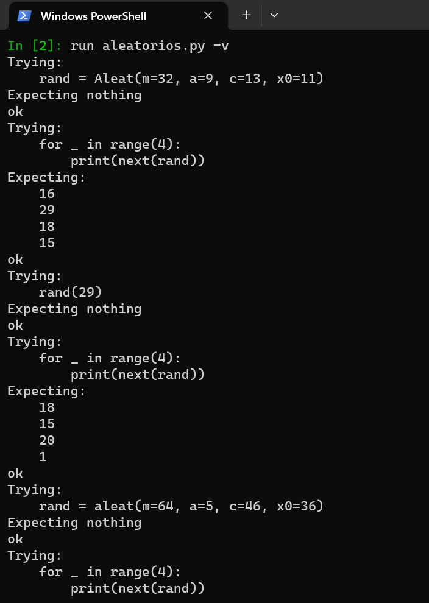
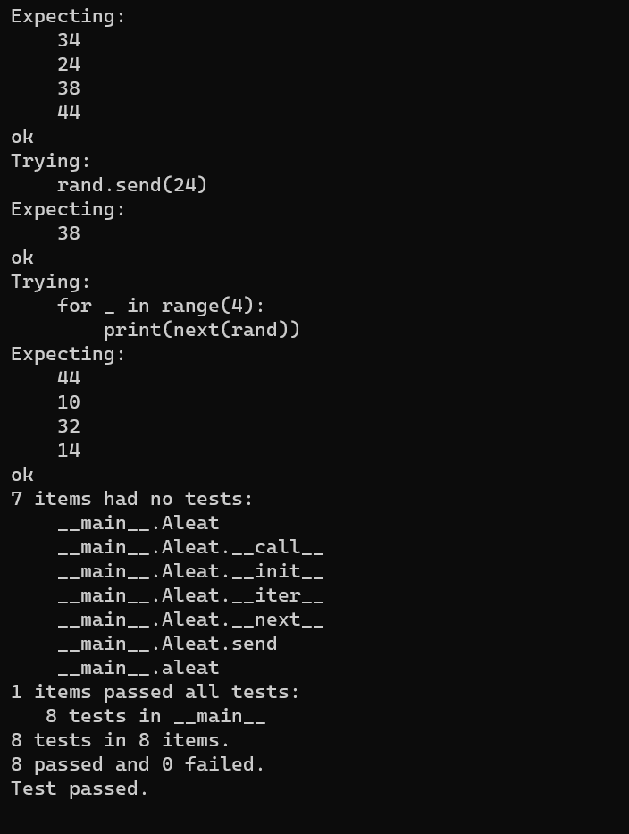

# Cuarta tarea de APA 2023: Generación de números aleatorios

## Nom i cognoms: Gisela León

## Generación de números aleatorios usando el algoritmo LGC

El algoritmo de generación lineal congruente
[LGC](https://en.wikipedia.org/wiki/Linear_congruential_generator) permite generar
secuencias pseudoaleatorias de características controladas. Se basa en aplicar
iterativamente la fórmula recursiva siguiente:

$$ x_{n + 1} = (a x_n + c) \mod m $$

Donde se denomina *módulo* a $m > 0$, *multiplicador* a $0 < a < m$, *incremento* a
$0 \le c < m$, y $0 \le x_0 < m$ es el valor inicial, o *semilla*, de la secuencia
aleatoria generada.

La secuencia es periódica, ya que, cada vez que repetimos un valor de $x_n$, volvemos a generar la misma otra vez. Los valores generados cumplen $0 \le x_n < m$; por tanto, la secuencia más larga posible es de longitud $m$, en cuyo caso, cada valor $0 \le x_n < m$ es producido una sola vez.

El módulo $m$ suele tomar como valor una potencia entera de dos para facilitar el cálculo del resto de la división entera mediante el operador desplazamiento de bits. Una elección adecuada del incremento $c$ y el multiplicador $a$ permite que la secuencia generada tenga el periodo máximo, igual a $m$:

- $m$ y $c$ no deben tener factores primos en común.
- $a - 1$ debe ser divisible por todos los factores primos de $m$ (aunque no mucho).
- Si $m$ es divisible por 4, $a - 1$ también debe serlo, pero no por 8.

Por ejemplo, el generador aleatorio del estándar POSIX usa los valores siguientes:

$$\begin{eqnarray*}
        m & = & 2^{48} \\
        a & = & 25214903917 \\
        c & = & 11
\end{eqnarray*}$$

## Ejercicios

Escriba el fichero `aletaorios.py` que implemente la generación de números aleatorios
usando tanto una clase iterable, `Aleat`, como una función generadora `aleat()`.

### Generación de números aleatorios usando la clase `Aleat`

Escriba la clase `Aleat` que implemente un generador de números aleatorios en el rango
$0 \le x_n < m$ usando el método LGC con las características siguientes:

- Los objetos de la clase serán iteradores, para lo que habrá de definirse el método
  mágico `__next__()`, que será el que efectuará la generación en sí misma y deberá
  devolver el número aleatorio siguiente.

- Los valores de `m`, `a` y `c` y la semilla `x0` deben ser configurables al crear el
  objeto (argumentos opcionales del método mágico `__init__()`). Estos cuatro argumentos
  opcionales serán indicados, obligatoriamente, por clave (no pueden ser posicionales).

  Por defecto, los valores de `m`, `a` y `c` serán los usados por el estándar POSIX. El
  de la semilla será `x0=1212121`.

- El método mágico [`__call__()`](https://docs.python.org/3/reference/datamodel.html#object.__call__)
  que sobrecarga la llamada a función, es decir, el uso del objeto como si fuera una
  función con sus argumentos entre paréntesis, se usará para reiniciar la secuencia con
  la semilla indicada en su único argumento, que será forzosamente posicional.

#### Pruebas unitarias de `Aleat`

La cadena de documentación de la clase deberá incluir las siguientes pruebas unitarias
a ejecutar con la biblioteca `doctest`:

##### Comprobación del funcionamiento de `Aleat`

```python
>>> rand = Aleat(m=32, a=9, c=13, x0=11)
>>> for _ in range(4):
...     print(next(rand))
...
16
29
18
15
```

##### Comprobación del reinicio de `Aleat`

```python
>>> rand(29)
>>> for _ in range(4):
...     print(next(rand))
...
18
15
20
1
```

### Generación de números aleatorios usando la función generadora `aleat()`

Escriba la función generadora `aleat()` que implemente el mismo generador de números
aleatorios en el rango $0 \le x_n < m$ que en el ejercicio anterior.

- Los valores de `m`, `a` y `c` y la semilla `x0` deben ser configurables al crear la
  función, y tendrán los mismos valores por defecto que en el caso de la clase `Aleat`.

- En caso de enviársele un valor al generador, con su método `send()`, éste debe
  reiniciar la secuencia tomando el argumento como semilla de la nueva secuencia.

#### Pruebas unitarias de `aleat()`

La cadena de documentación de la clase deberá incluir las siguientes pruebas unitarias
a ejecutar con la biblioteca `doctest`:

##### Comprobación del funcionamiento de `aleat()`

```python
>>> rand = aleat(m=64, a=5, c=46, x0=36)
>>> for _ in range(4):
...     print(next(rand))
...
34
24
38
44
```

##### Comprobación del reinicio de `aleat()`

```python
>>> rand.send(24)
38
>>> for _ in range(4):
...     print(next(rand))
...
44
10
32
14
```

### Entrega

#### Fichero `aleatorios.py`

- El fichero debe incluir una cadena de documentación que incluirá el nombre del alumno
  y una descripción el contenido del fichero.

- La cadena de documentación de la clase `Aleat` debeá incluir:

  - Una descripción del cometido de la clase.
  - Una descripción de los atributos y métodos de la clase.
  - Las pruebas unitarias correspondientes.

- La cadena de documentación de la función generadora `aleat()` deberá incluir:

  - Una descripción del cometido de la función.
  - Los argumentos de la función y la salida proporcionada.
  - Las pruebas unitarias correspondientes.

- Se valorará lo pythónico de la solución; en concreto, su claridad y sencillez, y el
  uso de los estándares marcados por PEP-ocho.

#### Ejecución de los tests unitarios

Inserte a continuación una captura de pantalla que muestre el resultado de ejecutar el
fichero `aleatorios.py` con la opción *verbosa*, de manera que se muestre el
resultado de la ejecución de los tests unitarios.

   

   

#### Código desarrollado

Inserte a continuación el código de los métodos desarrollados en esta tarea, usando los comandos necesarios para que se realice el realce sintáctico en Python del mismo (no vale insertar una imagen o una captura de pantalla, debe hacerse en formato *markdown*).

Clase Aleat:

```python
class Aleat:
    """
   
    Clase que implementa el generador de números aleatorios en el rango 0 <= xn < m
    usando el método LGC
    
    """
    
    def __init__(self, *, m=2**48, a=25214903917, c=11, x0=1212121):
        self.m = m      #Por defecto, los valores de m, a y c serán los usados por el estándar POSIX
        self.a = a
        self.c = c
        self.x = x0
    
    # Los valores de m, a, c y x0 son configurables al crear el objeto, 
    # y la semilla puede reiniciarse en cualquier momento usando la llamada a la función sobrecargada __call__().
    
    def __iter__(self):
        return self
    
    def __next__(self): #Efectua la generación en sí misma y devuelve el número aleatorio siguiete
        self.x = (self.a * self.x + self.c) % self.m
        return self.x
    
    def __call__(self, seed): #Reinicia la secuencia con la semilla indicada en su único argumento
        self.x = seed  

```

Pruebas unitarias clase Aleat:

```python
    """
    >>> rand = Aleat(m=32, a=9, c=13, x0=11)
    
    >>> for _ in range(4):
    ...     print(next(rand))
    ...
    16
    29
    18
    15
    
    >>> rand(29)
    >>> for _ in range(4):
    ...     print(next(rand))
    ...
    18
    15
    20
    1
    """
```

Función generadora aleat():

Tenemos que implementar el método send() en la clase Aleat

```python
    def send(self, seed):      #Dentro de la clase Aleat
        self.x = seed
        return next(self)
```

```python
def aleat(m=2**48, a=25214903917, c=11, x0=1212121):
    """
    La función aleat() es una función generadora que implementa la misma lógica que la clase Aleat, 
    pero sin necesidad de crear un objeto iterable. 
    
    """
    # Usa los mismos parámetros que la clase Aleat, con valores por defecto iguales.
    x = x0      # La semilla inicial es x0 y se mantiene en la variable x
    while True:                 #En cada iteración, la función calcula el siguiente valor de la secuencia      
        x = (a * x + c) % m     #pseudoaleatoria usando la fórmula del LGC y lo devuelve con yield 
        seed = yield x 
        if seed is not None:
            x = seed
    #Si se envía un valor al generador con send(), se reinicia la secuencia con ese valor como nueva semilla.
    #En ambos casos, la semilla se puede reiniciar utilizando el método __call__() o send().
```

Pruebas unitarias función generadora aleat():
```python
    """
    >>> rand = aleat(m=64, a=5, c=46, x0=36)
    >>> for _ in range(4):
    ...     print(next(rand))
    ...
    34
    24
    38
    44
    
    >>> rand.send(24)
    38
    >>> for _ in range(4):
    ...     print(next(rand))
    ...
    44
    10
    32
    14
    """
```

Para que las pruebas unitarias funcionen hay que importar la biblioteca doctest y ejecutar la función testmod():

```python
import doctest
doctest.testmod()
```


#### Subida del resultado al repositorio GitHub y *pull-request*

La entrega se formalizará mediante *pull request* al repositorio de la tarea.

El fichero `README.md` deberá respetar las reglas de los ficheros Markdown y
visualizarse correctamente en el repositorio, incluyendo la imagen con la ejecución de
los tests unitarios y el realce sintáctico del código fuente insertado.
